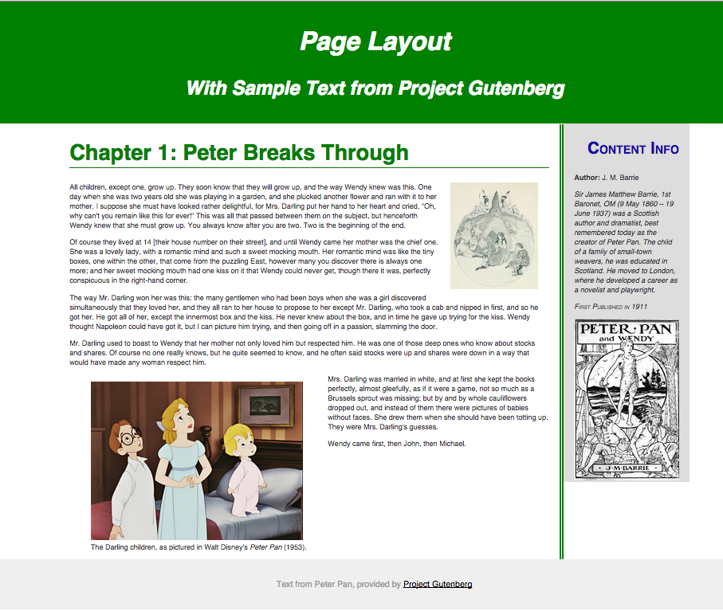

1. Click [this link](https://github.com/com372-14/layout-practice) to get to our [Layout Practice Repo](https://github.com/com372-14/layout-practice)
2. Fork the repository (at the top-right of the repo, under the toolbar you should see a button for "Fork")

<strong>Fork?</strong>

Forking allows you to create your own copy of a repository.

[Read more about forking](https://help.github.com/articles/fork-a-repo/)

3. Clone your repository to your computer.

**How?**
<ul><li>**Github for Mac / Windows** - click the "+" sign at the top-left of the window.  In the window that appears, change to the "clone" view.  You will see all the repositories that are part of your account.  Click on "layout-practice", then clone it into your "sites" folder</li>
<li>**SourceTree** - on GitHub, go to the home page of your repository.  On the right sidebar, there is an area with a url you can use to clone the repo.  Copy this url.  Now, open SourceTree.  In the bookmarks window (before you're in your project view), the top-left icon is something that looks like a barrel with a plus-sign on it.  Click this.  Paste your URL in the first box, then choose where you would like the repository to go.</li>
</ul>

4. Open Brackets.  Close any of your open working projects.  Then, click the top label of the file list to change your project.

5. Choose your layout-practice folder to open in Brackets
6. Open `index.html`.  Open this file in live preview.
7. We want the end result of our layout to look like the photo below.

4. Open your **style.css** file.
5. I gave you some starter styles.  Work for the rest of the class to make your page look like the sample.  You may have to change styles, or add new declarations.
6. First, set the ``content-wrap`` so that it is less than the whole width of the page and that it is centered in the middle of the page.

<pre><code class="language-css" data-lang="css">.content-wrapper{
  width: 80%;
  margin-left: auto;
  margin-right: auto;
}
</code></pre>

7. Set your ``article`` and ``sidebar`` to have widths that add up to 100%.  Float them next to each other.
8. Don't forget - when we float divs, we need to clear the parent!  What's the parent element?  I already included the style for `clearfix` in your stylesheet.  Add this class to the parent of the floated elements.
9. Add padding to your columns, your header, and your footer.
10. Float your image and your figure.
11. Change your background colors!
12. Take a look at your page and see what you think.
13. Uncomment the "normalize.css" file at the top of your index.html.  How has that changed the way your site looks?  We should use normalize in our projects to help us handle browser inconsistencies.
12. Be sure to save your work and commit to GitHub.