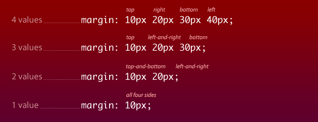

## Due For This Class

1. [Project #4](http://com372-14.github.io/projects/04-tables.html)
2. Work through the first 13 ([Learn CSS Layout](http://learnlayout.com/display.html) lessons (stop after you have read the **percent width** page).

## Time to Get Inspired

As the course goes on, I will be asking you to start marking things you find interesting on the web.  For example, you might want to save designs you find especially cool, or articles you loved, or photos you wanted to use.

Everyone in the class will need to sign up for an [Evernote](https://www.evernote.com/) account.

Then, install the [Evernote Web Clipper](https://evernote.com/webclipper/) on your browser.

You can now use the web clipper to document cool things you find on the web!

### Starting points for inspiration

- [Awwwards](http://www.awwwards.com/)
- [Dribbble](http://dribbble.com)
- [Webby Awards](http://www.webbyawards.com/)
- [ThemeForest](http://www.themeforest.com/)
- [Wordpress.com Themes](http://theme.wordpress.com/)
- [A List Apart](http://alistapart.com/)
- [One Page Love](http://onepagelove.com/)
- [Smashing Magazine](http://www.smashingmagazine.com/)
- [CodePen](http://codepen.io/) - awesome experimenty things!
- [CoDrops](http://tympanus.net/codrops/) - awesome tutorials, and downloadable "blueprints".

### A Note on Templates / Downloadable Themes

The purpose of this class is for you to learn to design your own websites.  As you look around, you will no doubt find **free** themes and pre-styled web templates.  With the exception of CSS frameworks (which we will learn in class), using a premade **theme** is unacceptable for your final project.

If you are interested in downloading a pre-built theme to play around with it and try to learn how it is built - **I highly encourage this**.  Tell me!  Add it to your inspiration journal!  Add it to your project portfolio!  Share what you've built with me!  If there's a cool feature that you're trying to duplicate, I might be able to point you in a helpful direction.

## CSS Shortcuts

I handed out a paper in the last class with shortcuts for writing common CSS things.

When you write margins, for example, you can write the css as follows:

```css
.element{
  margin-top: 5px;
  margin-right: 25px;
  margin-bottom: 35px;
  margin-left: 15px;
}
```

It is easier to combine all of these into one declaration.

```css
.element{
  margin: 5px 25px 35px 15px;
}
```

Note, the values go clockwise - first, the top value, then right, then bottom, then left.

You can also shorten it further, if you have all of the same values (or some of the same values).

<figure><figcaption><cite>from <a href="http://www.smashingmagazine.com/2008/08/18/7-principles-of-clean-and-optimized-css-code/">Smashing Magazine's guide to clean code</a></cite></figcaption></figure>


You can read more about shorthand properties at [HTML Dog](http://htmldog.com/guides/css/intermediate/shorthand/).

In the CSS Tricks Almanac (and most other CSS references), you will typically find the shorthand for properties that allow it.  For example, look at the [almanac for font](http://css-tricks.com/almanac/properties/f/font/).


## Class Activity

<div class="activity">

{{ my_include | markdownify }}
</div>

## Homework

1. **Get Inspired** - start looking around on the web for things that inspire you - projects you like, screenshots of other websites, articles that interest you.  Start working on your Evernote journal.  You should continue adding to this as the semester continues.  On **October 27**, I will be asking you to write a brief overview of your journal, and another at finals.
2. Complete the next two lessons in CodeCademy
  *  [HTML Basics III](http://www.codecademy.com/courses/web-beginner-en-f8mcL) (Due Wednesday, October 8, 2014)
  *  [Project: Clickable Photo Page](http://www.codecademy.com/courses/web-beginner-en-zrZ6c) (Due Wednesday, October 8, 2014)
3. Read Chapter 5 (Mini-Art School) and Chapter 7 (Type) in White Space is Not Your Enemy.