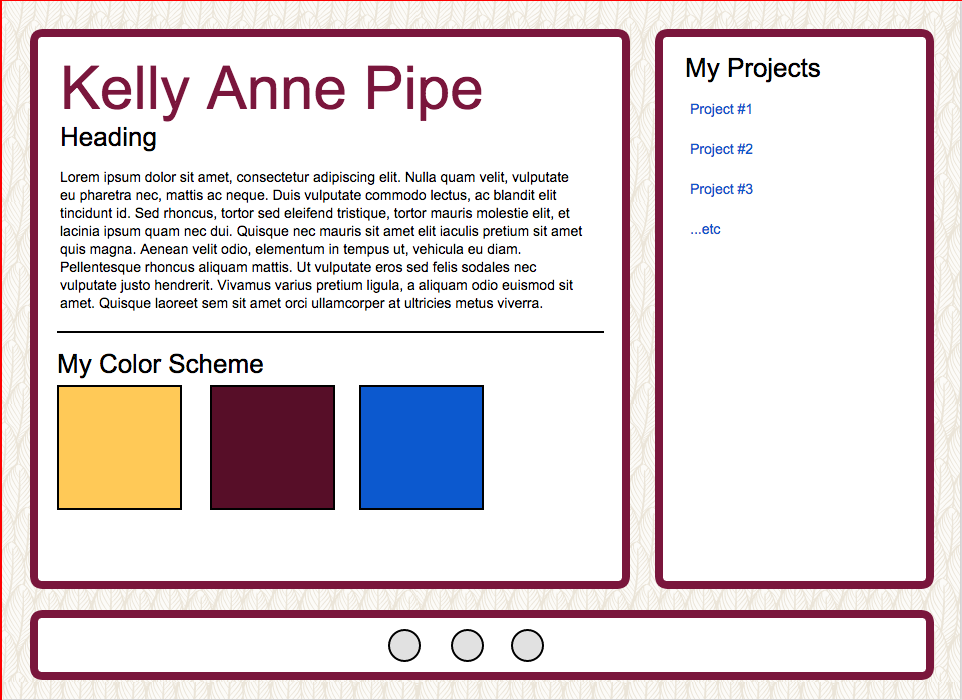

## Due For This Class

- Complete [Project #7](http://com372-14.github.io/projects/07-prototypes.html)

## Activity

For this class, complete the following activities.  I will walk around and assist as needed.

### Project Portfolio

Utilizing this prototype as an example, re-style your project portfolio to have the following features:

1. A subtle background image
2. Two columns and a footer.  There should be space between the edges of the browser and the columns
3. The columns and footers should have background colors and borders.
4. Your projects should be listed in the sidebar with a heading.  
5. Make the list so that it is not indented and it does not have bullets.  
6. Make the list items have spacing between them.
7. Your footer should have links to, at minimum, your GitHub account and your Email.  Utilize an icon font for this.
8. You may use a different layout if you create your own prototype first, using a tool such as https://wireframe.cc/ or https://moqups.com and review this with the professor

### CodeCademy

1. Finish the final two lessons of CodeCademy, listed here - http://com372-14.github.io/projects/11-codecademy.html

## Homework

- If you did not complete the CodeCademy lessons, keep working on them.
- If you did not finish styling your project portfolio homepage, complete it before the next class.